# Trash Cluster Generator
---

    
     
     

[cc-by-nc-sa]: http://creativecommons.org/licenses/by-nc-sa/4.0/./
[cc-by-nc-sa-image]: https://licensebuttons.net/l/by-nc-sa/4.0/88x31.png

**Trash Cluster Generator** uses random closed curves generated using [Bézier parametric curves equations](https://en.wikipedia.org/wiki/B%C3%A9zier_curve) to generate clusters of trash (i.e., metal, glass, plastic, etc.) along with their segmentation masks. This helps in creating controlled pseudo-random data, ideal for trash segmentation.

## Contents

* [Overview](#overview)
* [Setup](#setup)
* [Usage](#usage)
     * [View](#views)
     * [Sliders](#sliders)
     * [Buttons](#buttons)
     * [Indicators](#indicators)
     * [Other](#other)
* [Contribute](#contribute)
* [Acknowledgements](#acknowledgements)
* [License](#license)

## Overview

Trash cluster generator is implemented on Python. GUI is made using [Matplotlib Widgets](https://matplotlib.org/stable/api/widgets_api.html) and functions make use of [Numpy](https://numpy.org/) and [Pillow](https://python-pillow.org/) libraries extensively. The program generated pseudorandom closed curved based on certain input parameters. The generated curve is then used to place random (RGBA) images of trash on various backgrounds. 

This program was made to fulfill our needs to generate synthetic data for [Beach Garbage Detection](https://www.kaggle.com/vigneshdesmond/beach-garbage-detection?select=synth_images). Thus, beach images are used here as example backgrounds. But any image can be used as either foreground or background. See [Setup](#setup) for more.

     
        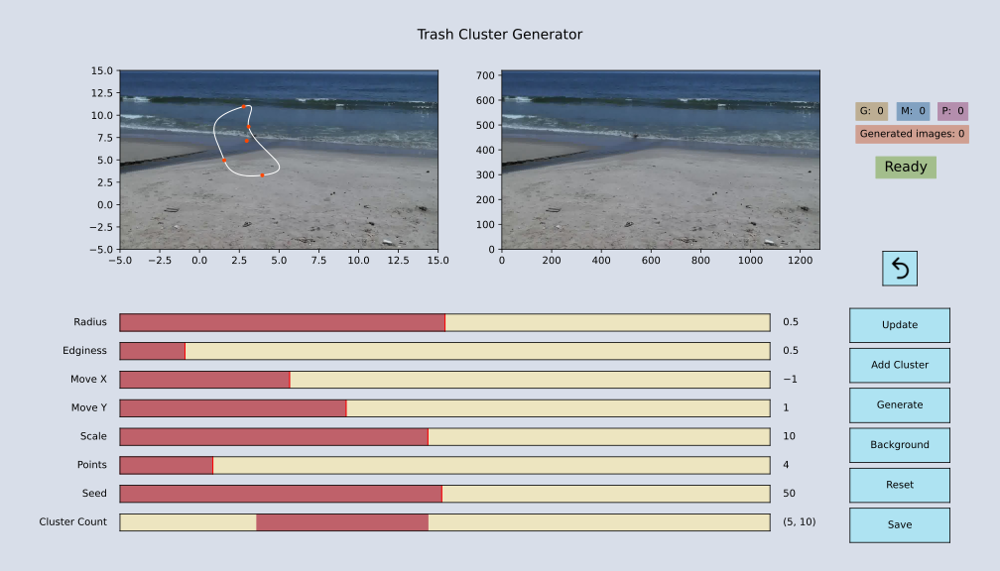
        Layout on start
     

## Setup

### Basic setup:

- Clone this repository and change current working directory to the cloned directory.
- (*Optional*) Create a virtualenv or equivalent.
- Install the required packages by the command `pip install -r requirements.txt`
  
### For custom backgrounds:

Place your backgrounds in [`bg_images`](./bg_images)

Each background needs its corresponding label, which is just the base segmentation mask. The pixel values correspond to the class of objects in background image, an example would be: `Beach = 1` and `Sea = 2`. Place these labels with the same name in [`bg_labels`](./bg_labels). Note that labels are in PNG format.

RGB labels are for visualization/comparision only, and not used in the code.

**Note:** Use background images of same dimensions to avoid inconsistent view and placement.

Before going to the next step, go into [`pixeltest.py`](./pixeltest.py), change the code according to the classes you have and run it, to see if all labels are have expected pixel values.

### For custom foregrounds:

The foregrounds are mainly trash images collected from [trashnet](https://github.com/garythung/trashnet), segmented manually by us and extracted as RGBA images. If yow want to use your own, place them in [`foregrounds`](./foregrounds). Make sure the images are quite small (atmost 1/3 of image width). 

**Note:** The foreground images should be named with their class value at start seperated by a underscore. For example: `3_blabla.png`, `3_wahwah.png`, `4_oioioi.png` and so on, where 3 and 4 are the respective class values.

### Changes in code:

Change the dimensions accroding to your background images [here](https://github.com/Vignesh-Desmond/trash-cluster-generator/blob/957010ad59a85ac4de52534f87f9e11c7248c1a4/tcg.py#L29-L30)

Change the colors to be set in RGB labels [here](https://github.com/Vignesh-Desmond/trash-cluster-generator/blob/8e9d96bd70987f2f95fcb5ef0f05371dc4f73a47/utils/generator.py#L23-L27) according to the number of classes and their types. Also change [this line](https://github.com/Vignesh-Desmond/trash-cluster-generator/blob/8e9d96bd70987f2f95fcb5ef0f05371dc4f73a47/utils/generator.py#L304) to the number of classes.

Change the classes (and other params) in this [dict](https://github.com/Vignesh-Desmond/trash-cluster-generator/blob/957010ad59a85ac4de52534f87f9e11c7248c1a4/tcg.py#L89), which shows the count of each class for a particular image. See [Indicators](#indicators) for more.

Tweak the augmentation parameters for foregrounds [here](https://github.com/Vignesh-Desmond/trash-cluster-generator/blob/8e9d96bd70987f2f95fcb5ef0f05371dc4f73a47/utils/generator.py#L47-L58).

These are the minimal changes to be done. However you can modify the code extensively to suit your needs.

Finally run `python tcg.py` and you shoud be greeted with the layout shown above.

## Usage

The layout consists of multiple parts as shown below.

     
        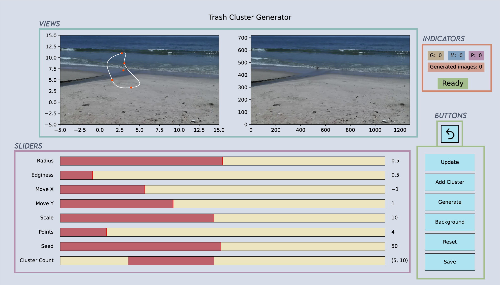
        Parts of layout
     

### Views

There are 2 views, each view being an matplotlib subplot with corresponding axes and ticks.

- The view on the left, known as **Curve View** shows the random Bézier closed curve plotted on top the current background. Any change in the slider value will generate a new curve which will be updated in this view. Also changing the background will also be updated here.

- The view on the right. known as **Generator View** shows the current generated image. This view gets updated on generating, adding, updating and undoing clusters, and shows what image will be saved.

### Sliders

There are 8 sliders in total, out of which first seven controls the closed curve shown in Curve View and last slider controls the range of foregrounds per cluster.

#### Curve sliders

*Radius*: The radius around the points at which the control points of the Bézier curve sit. This number is relative to the distance between adjacent points and should hence be between 0 and 1. The larger the radius, the sharper the features of the curve.

        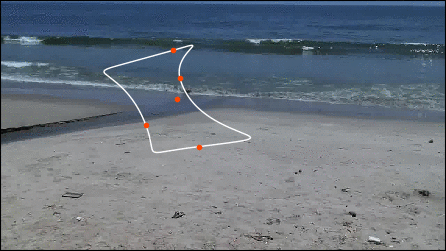
         Visualization: Changing radius
     

*Edginess*: A parameter to determine the smoothness of the curve. If 0 the angle of the curve through each point will be the mean between the direction to adjacent points. The larger it gets, the more the angle will be determined only by one adjacent point. The curve hence gets "edgier".

        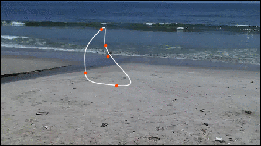
         Visualization: Changing edginess
     

*Points*: The number of random points to use. The minimum number of points is 3. The more points you use, the more feature rich the shapes can become; at the risk of creating overlaps or loops in the curve.

        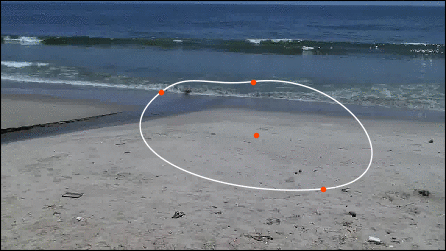
         Visualization: Changing number of points
     

#### Transform Sliders

*Move X*: Translates the curve along the X axis (i.e., horizontally)

        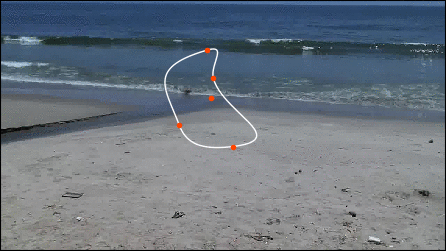
         Visualization: Translating along X
     

*Move Y*: Translates the curve along the Y axis (i.e., vertically)

        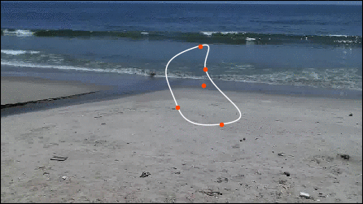
         Visualization: Translating along Y
     

*Scale*: Changes the scale of the curve along the diagonal axis.

        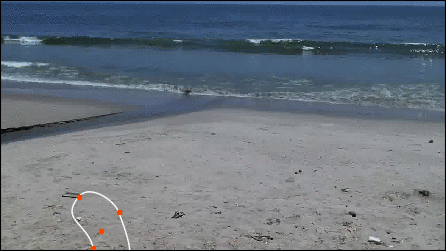
         Visualization: Changing scale
     

#### Other sliders

*Seed*: Generates a random Bézier curve.

*Cluster limit*: Range Slider that sets the range of foreground objects for a given cluster. (3,7) means a cluster can have a minimum of 3 and a maximum of 7 foregrounds per cluster.

### Buttons

There are 7 buttons in total. Each button's function is given below.

#### Generator buttons

*Generate*: Generates a new cluster every time. Note that each time you press generate, the previous cluster is removed. So use this button for generating the first cluster.

        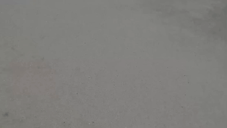
         Visualization: Generate
     

*Add cluster*: Adds a new cluster on top of previous cluster. Note that this does not work if no base cluster is generated using *Generate* button, and throws an error. There is no limit for adding clusters.

        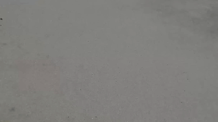
         Visualization: Add Cluster
     

*Update*: Updates the currently generated cluster based on new slider values for Radius, Edginess, Move X, Move Y and Scale and may throw error if Points or Seed slider is changed before updating. Works for both base and added cluster.

        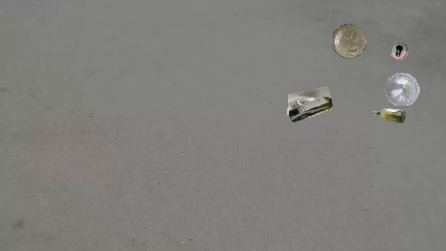
         Visualization: Update
     

#### Other buttons

*Background*: Changes the background image. (On pressing, only the Curve View will update, the Generator View will automatically update **only on Generate**.)

*Save*: Saves the current generated image, along with it's label and RGB label with timestamps as filename tail. (Requires atleast one cluster to be Generated.)

*Reset*: Resets Sliders and Views to Home layout.

*Undo*: Returns to previous state (before generating/adding/updating a cluster).

### Indicators

There are 3 indicators.

#### State indicator

Displays state of success, warning or error.
* Success states - *green*
     * Saved (image)
     * Generated (cluster)
     * Added (cluster)
     * Updated (cluster)
     * Undone (to previous state)
     * Changed (background)
     * Reset

* Warning states - *yellow*
     * Generate New (cluster before adding/updating/saving)
     * Out of Bounds (cluster), Retry.
     * Cannot undo (no previous state)

* Error states - *red*
     * Error - See logs (unhandled error)

#### Count indicators

*Saved image count*: Displays the number of images saved.

*Class distribution*: Displays the count of each class for each image. (Resets on new generate.)

### Other

#### Logs

The console shows log messages while the program runs. The logs are similar to state indicator messages but more verbose. It helps in debugging/reporting errors from traceback.

#### Zip all

The [zipper](./zipper.py) is a simple script that neatly zips all generated images into 3 zip archives: `img.zip`, `label.zip`, `rgb_label.zip` and cleans up the generated files.

#### Backend

The program uses PyQt5 backend by default. If you want a different backend like Tkinter, change [here](https://github.com/Vignesh-Desmond/trash-cluster-generator/blob/5e9e47fdf2fc7596353cedffbba2e40522ca574c/tcg.py#L27)

## Contribute

Thanks for all these people who contributed immensely to this project.

 
 

To contribute, see [this](./CONTRIBUTING.md)

## Acknowledgements

This project uses [Trashnet](https://github.com/garythung/trashnet) for its foregrounds, so thanks to the [creator](https://github.com/garythung) of this dataset.

This work was initially given a headstart from this StackOverflow answer: https://stackoverflow.com/a/50751932/3237302, so thanks to this [user](https://stackoverflow.com/users/4124317/importanceofbeingernest) although there are now significant differences in behavior and features.

## License

This software is licensed under the terms of the [MIT License](./LICENSE).

The assets in folders: [`docs`](./docs), [`bg_images`](./bg_images), [`bg_labels`](./bg_labels) and [`bg_rgb_labels`](./bg_rgb_labels) are licensed under a
[Creative Commons Attribution-NonCommercial-ShareAlike 4.0 International License](./LICENSE-CC-BY-NC-SA).

[![CC BY-NC-SA 4.0][cc-by-nc-sa-image]][cc-by-nc-sa]